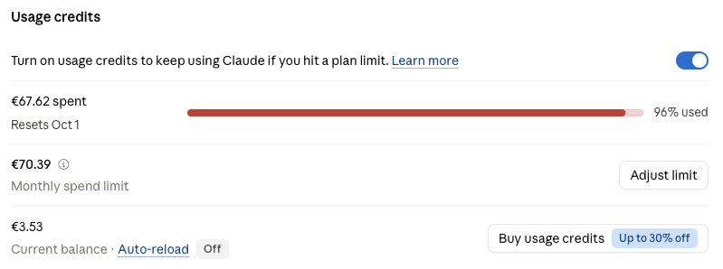

<div align="center">
  

  <h1>Music</h1>

  <p>
    A self-hosted, modern and clean web client for <a href="https://www.navidrome.org/">Navidrome</a>.
  </p>
</div>

Streams your own library through the Subsonic/OpenSubsonic API, adds a "For You" discovery layer powered by Deezer's public API (30-second previews), and installs as a home-screen web app on iPhone and Mac. One container, one SQLite file, nothing else to run.

<div align="center">
  
  <br />
  
</div>

---

## Features

### Library

Albums, artists, songs, playlists, search. Filter and sort on every list page. Desktop gets a sidebar with the full category list; mobile gets a bottom tab bar and a library hub.

### Player

Queue, shuffle, repeat, gapless preload, ReplayGain loudness normalisation, bitrate/transcode selector, lock-screen and Control Center controls via Media Session, keyboard shortcuts on desktop, swipe gestures on mobile. Audio is proxied through the app — Navidrome credentials never reach the browser.

### Liked Songs

Heart any track. Synced with Navidrome's own starring, so it shows up in every other Subsonic client too.

### Music discovery (For You)

After 200 plays, suggests related artists and recent releases from the artists you actually listen to, cross-checked against your library so it only shows things you don't own. Deezer previews, dismiss what you don't like.

Bookmark anything you find to the **Wishlist**, which lives at the top of For You. "Copy as text" exports it (`[album] Artist - Title (Year)` per line) to paste into whatever you use to acquire music. The app itself never downloads anything.

### Settings

Theme, gapless, loudness normalisation, streaming quality, library stats, trigger a Navidrome rescan. Every user logs in with their own Navidrome credentials — shared library, per-user history and recommendations. No admin panel; user management stays in Navidrome. Stored credentials are AES-256-GCM encrypted at rest.

---

## Disclaimer

**Built for macOS Safari and iOS Safari only.** Layout, gestures, PWA install, Media Session and audio behaviour are tuned for those two targets and nothing else is tested. It will probably load elsewhere, but expect rough edges.

**Written by AI.** The entire codebase — schema, API layer, player, UI, Docker setup, this README — was written by **Claude Fable 5.1** (Anthropic) in a chat session, from a written spec, with a human testing on a real Navidrome server and reporting bugs. No line was hand-written. It works, it's readable, it has not been audited by a human.

Total cost, ~**€68** in API tokens:



### Known issue

iOS 26 has a WebKit regression ([bug 295518](https://bugs.webkit.org/show_bug.cgi?id=295518)): audio in a home-screen PWA may not resume after the app is backgrounded and reopened. The same page in a normal Safari tab works. Apple's bug, not fixable app-side yet.

---

## Stack

SvelteKit 2 · Svelte 5 · Bun · SQLite (Bun built-in) + Drizzle · Tailwind v4 (shadcn Zinc tokens) · Lucide · Docker

External APIs: Navidrome (Subsonic/OpenSubsonic), Deezer public API (no key), lrclib.net.

---

## Self-hosting

Tested on a Raspberry Pi 5 (arm64) next to an existing Navidrome container. Any Linux box with Docker works. Images are built for `linux/amd64` and `linux/arm64` and published to `ghcr.io/ze-castro/music` — the server never needs the source.

**Requirements:** Docker + Compose v2, a running Navidrome reachable from the Docker host, and ideally a reverse proxy with HTTPS.

### 1. Get the two files

```sh
mkdir -p ~/music && cd ~/music
curl -O https://raw.githubusercontent.com/ze-castro/music/main/deploy/docker-compose.yml
curl -o .env https://raw.githubusercontent.com/ze-castro/music/main/deploy/.env.example
cp .env.example .env
```

### 2. Fill `.env`

| Variable         | What                                                                                                                                     |
| ---------------- | ---------------------------------------------------------------------------------------------------------------------------------------- |
| `ENCRYPTION_KEY` | 32 random bytes, base64. `openssl rand -base64 32`                                                                                       |
| `SESSION_SECRET` | Any long random string. `openssl rand -base64 48`                                                                                        |
| `NAVIDROME_URL`  | Navidrome address **as seen from inside Docker**, e.g. `http://192.168.1.50:4533`. Leave empty to let users type it on the login screen. |
| `ORIGIN`         | The exact URL people will open, e.g. `https://music.example.com`. Wrong value → login silently fails (CSRF check).                       |

```sh
sed -i "s|^ENCRYPTION_KEY=.*|ENCRYPTION_KEY=$(openssl rand -base64 32)|" .env
sed -i "s|^SESSION_SECRET=.*|SESSION_SECRET=$(openssl rand -base64 48)|" .env
```

**Do not lose `ENCRYPTION_KEY`.** It decrypts every stored Navidrome password. Rotate it and everyone has to log in again.

### 3. Run

```sh
docker compose up -d
```

The app listens on host port **47213**. The SQLite database lives in `./data/` next to the compose file — that folder is the only thing to back up. Migrations run automatically on start.

### 4. Reverse proxy (Caddy example)

```
music.example.com {
    reverse_proxy localhost:47213
}
```

Set `ORIGIN=https://music.example.com` in `.env`, then `docker compose up -d` — no image rebuild needed for env changes.

### 5. Install on iPhone / Mac

Open the URL in **Safari** (not Chrome) → Share → **Add to Home Screen** (iOS) or **Add to Dock** (macOS Sonoma+). Log in with your Navidrome username and password.

### Navidrome in Docker on the same host

The compose file joins a network called `navidrome_default` (the default name when Navidrome's compose lives in a folder called `navidrome`) so `NAVIDROME_URL=http://navidrome:4533` resolves. Check yours with `docker network ls` and edit the `name:` at the bottom of the file. If Navidrome is not in Docker, delete the `networks:` lines and use its LAN address.

### Update

```sh
docker compose pull && docker compose up -d
docker image prune -f
```

Pin a version instead of `latest` by changing the image tag to e.g. `ghcr.io/ze-castro/music:v1.0.0` (tags match git tags) or a short commit SHA.

### Useful commands

```sh
docker compose logs -f              # app logs
docker compose ps                   # status
docker compose up -d                # apply .env changes
docker compose down                 # stop (./data survives)
```

---

## Local development

Repo-root `docker-compose.yml` builds from source (HTTP, non-secure cookies).

```sh
cp .env.example .env            # fill secrets
docker compose up -d --build    # → http://localhost:47213
```

Or on the host, no Docker:

```sh
cp .env.example .env
bun install
bun run dev                     # http://localhost:5173 — SQLite file created at ./data/music.db
```

`bun run build` must run under Bun (the script already does `bun --bun vite build`) because the SQLite driver is `bun:sqlite`. `bun run check` for type-checking. After editing `src/lib/server/db/schema.ts`, run `bun run db:generate` and commit the new file in `drizzle/`.

If `bun install` complains about the lockfile version, delete `bun.lock` and reinstall.

### Project layout

```
src/lib/server/
  db/schema.ts         users, sessions, listening_history, recommendations_cache, wishlist, lyrics_cache
  crypto.ts            AES-256-GCM for stored Navidrome passwords
  session.ts           JWT cookie → sessions row → user
  subsonic/            typed Subsonic/OpenSubsonic client, fresh salt+token per request
  deezer/              related artists, albums, top tracks, previews
  lrclib/              synced lyrics (not wired into UI yet)
  recs.ts              "For You" pipeline
  wishlist.ts          wishlist queries
src/lib/stores/        player, settings, likes, wishlist, preview (Svelte 5 runes)
src/lib/components/    TrackList, AlbumCard, ListHeader, MiniPlayer, NowPlaying, LikeButton, WishButton, …
src/routes/api/        stream + cover proxies, scrobble, star, recs, wishlist, settings
```

---

## Issues and forks

Issues are welcome — bugs, questions, ideas.

**No support for Windows, Android, Chrome, Firefox or Linux desktops.** Those are not tested and will not be fixed here. Fork it and make it work wherever you want.

## License

MIT
